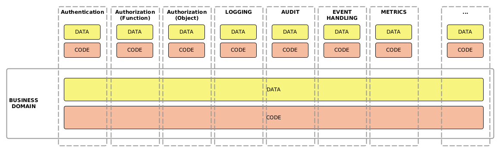

# auditking
Small yet powerful audit trail recording library based on Java and MongoDB

## Introduction

## Primary purpose of audit trail recording

The primary purpose of the audit trail recording is to register any changes to the selected objects that happens in context of the business domain.

We want to register that information but we would like to keep that operation as well the resulting data separately from our business domain.

The need for collection of such information may stem from internal needs of keeping detailed log of changes that can be easily followed and analyzed. The other reasons may be of external nature, for example keeping the detailed record of changes of vital data may be the regulatory requirement and a subject of temporary compliance audits.

- Recording changes in the **selected data objects**

- **When** the change happened

  The timestamp of that event should be definitely recorded.

- Nature of the **operation**

  While the main focus is on the Update, Create or Delete operations, we can optionally register whether the data was even accessed (Read).

- **Who** did the changes

  It is important to record the system or the user who initiated the change.

- **What** changed specifically

  It might be important to know what properties of objects changes specifically.

- **Reason** for change

    An additional commentary may be added to the audit entry where the originating party provides explanation for the changes. 

- **The context of the operation**

    It may be useful to see in context of what business function the set of changes to the business object was made.

### Business logic code + business data are the core concern

The main concern of the software developers is usually building the business logic that governs the business data. And additionally (and optionally) the interface(s) to interact with that business logic.

Below are shown some common examples of such supportive functions (which are called **aspects**) and how they transect the Business Domain but still they are still decoupled in terms of code and the data.



### Aspects are of supportive role to business logic/data
  
  Examples:
  - Authentication (who is the user)
  - Authorization (what the user can access/do)
    - function based
    - object instance based
  - Event logging (what happens in the business logic)
  - Error handling (how we want to report the errors)
  - Audit trail recording (how we want to record who changed the data)
  - Other examples:
    - Validation
    - Caching
    - Transactions
    - Internationalization
    - Retry logic
    - Metrics collection
    - Performance monitoring
    - Data limiting and throttling
    - Retry mechanism
    - Data transformation

### Aspects ARE separate concerns

Aspects have not only supportive role to the core business logic but also should be considered as dealing with entirely different concerns on their own, separate from the business logic, not affecting it in considerable way. They are orthogonal to the business logic.

As the business domain is the core concern, we want to keep it as clean and unobstructure with other concerns as possible.
This is important as we want to make the code as easy to understand, code, follow, maintain and test.
Adding more concerns causes the code to be interweaved and thus increasingly complex where it is very hard to discern which lines of code belong to the business domain and which serve just a supportive function.

When such need for separation of concerns is ignored it may lead gradually to the gridlock when the code and the data of the system becomes so complex and hard to maintain that the better decision is to decommission the system entirely and rewrite the code from the scratch, in hope for better results this time.

The other concern of the auditing data can be the retention requirements. The audit trail data may be kept in shorter time period than the code business domain data. 

Performance-wise the auditing processes may be entirely detached from the business domain code so any performance impact of these operations can be minimized and delegated to different processing units. 

### Audit trail recording is an aspect

The functionality of recording the audit information is NOT a core business logic, but rather is a supportive functionality.
This realization should guide the design of the application and proper separation of concerns should be followed which means that the audit trail recording code should be clearly separated, reusable, as well the data should be kept in clear separation from the business data even if it touches certain aspects of that data.

### Reasons why the aspect data and code should be kept outside the business logic
  - Its behavior and data structures may **change independently**
  - We want to keep our business logic and data clean just **clearly separated from other concerns**.
  - **Better code reuse** (no need to reimplement the functionality in business logic code)
  - **Better performance** as part of the processing can be delegated asynchronically to specialized aspect services and not affect business logic performance. 


## Features of Auditing Framework

If the auditing functional domain is carefully separated from the business logic there are various profound (and beneficial) consequences:

- **Asynchronous processing**

  When the data needs to be saved into the audit database, we want it to me as performant as possible. Therefore any function like this should be in principle asynchronic (either sending the data to the queue for further processing or spawning new detached thread). This feature should make the code very performant and have minor effect of on the overall business logic performance.

- **No changes to the business data structures**

  When the information collected for the audit trail purposes is kept out from the business data - the data structures can be considerably de-cluttered, holding only the relevant information.

- **No additional code** needed to be added to the business logic.
- **Very simple data extraction** from the DB for reporting purposes.
- Storing **whole history** of object changes
- **No need to modify the core business data structures**
- The **audit database can be separate** from the business data
- The **retention can be added and managed separately** from the business data retention.
- **Selective object recording** can be done through the configuration.

    That means no code changes are required to include or exclude any objects from the audit trail recording.

- We can store **whole values of objects** before and after the change or just the **difference**.


## Design

We can identify following concerns:
- Interfacing with business code (Auditor)
- Performing the recording task (Recorder - abstracted, as there can be various strategies of recording an auditing entry)

  There can be multiple strategies of recording the changes:

  - **Direct**

    The operation of recording the change would happen immediately. This option is easiest but it may affect performance slightly.

  - **Asynchronous**

    Each time the change recording is requested it is delegated to the separate detached thread. This is the best solution for any performance sensitive operations.


- Storing the auditing entry (Storage - abstracted)

  Different storage options can be available:

  - Console - the changes will be just dumped as a messages in the console. This option is good for testing purposes.
  - MongoDB - the data can be stored in the separate database for future retrieval and analysis.
  - MQ - the changes can be sent to specific queue as a message. The recipient system will take care to properly store these changes. This is an ultimate performance saving method that not only causes the change to be recorded and saved in the DB in completely detached fashion from the business domain.

- Performing the object difference analysis (DifferenceAnalyzer).

### What is in the audit entry

The auditing framework collects the information in two structures (stored in separate tables/collections):
* The context of the business operation.
* Changes to the exact objects in relation to the above context.

```javascript
operation: {
    id,
    systemId,   // Originating system ID. A textual identifier.
    method,     // Details of the business method
    startTime, endTime, // Timestamps of the start and end of the business method
    reason, // Business reason for the change. 
}

change: {
    id,
    systemId,   // ID of the system that the change object belongs to
    operationId, // Reference to the operation within which the change was performed. 
    objectClass,    // Name of the object class - fully qualified Java class name
    objectId,   // ID of the object instance
    time, // Timestamp of change
    originatorId, // user name or system ID of the originator of the change.
    difference, // map showing the differences to the business object that were made during the business operation.
    oldValue, newValue, // optional, the previous and new value of the business object being subject of change
}
```


## Sample Java code

Consider following hypothetical rendering:

```Java
import org.springframework.stereotype.Service;

@Service
public class MyService{
  @AuditedMethod  
  public updateBusinessObject(BusinessObject obj, @AuditedReason String reason){
    // Do changes to the `obj`
    obj.name = "Business Object";
    repository.save(obj);
  }   
}
```

Now we can see that our business logic is clearly visible and neatly separated from the auditing envelope

The `@AuditedMethod` annotation takes an optional parameter which is the list of function parameters that should be subject of audit trail (as there can be more than one). 

The optional parameter can be added that may contain the commentary explaining the business reasons for the change. This comment is specifically intended to be added to the audit entry, therefore it needs to be annotated with `@AuditedReason` annotation to indicate to the auditing mechanism that it is the purpose of that parameter.

The above annotation will cause to create the auditing context when this method is called and within that context any of the updates to the data repositories will be recorded.
In order to make sure that the data handled by the repository will be recorded withing the auditing context - make sure to add the `@auditedRepository` annotation to the repository interface declaration. For example:
```Java
import com.tribium.auditking.core.AuditedRepository;
import org.springframework.data.mongodb.repository.MongoRepository;

@AuditedRepository
public interface SampleAuditedRepository 
        extends MongoRepository<SampleAuditedObject,String> {
}
```

### Getting report on the object changes

```Java
// by object id
auditor.reportChanges(systemId, objectClass, objectId);

// by object class
auditor.reportChanges(systemId, objectClass);
```
In the result the above method should return all of the changes that were done on an object of given class and with given ID.

To report all changes made by specific user:
```Java
auditor.reportChanges(systemId, userId);
```

## Decision Matrix

So now we can compare this concept of auditing with other techniques that are in commonly in use.

* **Technique I** - Adding timestamp to tables (**Timestamp**)

    One if the common techniques is to add the timestamp and the ID of the updater to each record of the object in the table.

* **Technique II** - Timestamp and a record copy (**Multiple Records**)

    The other method is to create new record in the table upon the change of any o the values. This way we can have the whole history of changes.

| Criterion                           | AuditKing                                                                       | Timestamp                                                                    | Multiple Records                                                                                                       |
|-------------------------------------|---------------------------------------------------------------------------------|------------------------------------------------------------------------------|------------------------------------------------------------------------------------------------------------------------|
| **Separation of Audit/BL code**     | **YES**                                                                         | NO - audit information is still in the business DB                           | NO - audit data mixed with business data, specialized code needs to be written to handle this for each table/object    |
| **Separation of Audit/BL data**     | **YES**                                                                         | NO                                                                           | NO                                                                                                                     |
| **Impact on writing business code** | **ZERO**                                                                        | SOME - some code needs to be called to write this information to each record | HARD - more complex code needs to be written to write updates as well to retrieve the data.                            |
| **Audit data retrieval**            | **EASY** - one query                                                            | HARDER - query/object                                                        | HARD - query/object                                                                                                    |
| **Impact on performance**           | **SMALL** - if async method is used                                             | **TINY** - as the change is attached to the record which is written already. | LARGE - each query needs to use more resources to sieve through many values, additional indices needed for each table. |
| **Human error factor**              | **TINY** - just add an annotation for the code to work.                         | SMALL - more coding is needed                                                | LARG**FULL**E - complex coding is required                                                                             |
| **Size of code**                    | **TINY**                                                                        | SOME                                                                         | LOTS                                                                                                                   |
| **Maintenance effort**              | **SMALL** - BL and Auditing code can change separately unaffected by each other | LOTS - code is coupled                                                       | LOTS - code is coupled                                                                                                 |
| **History or changes**              | **FULL**                                                                        | LAST CHANGE ONLY                                                             | **FULL**                                                                                                               |
| **Information on what changed**     | **FULL**                                                                        | NOTHING                                                                      | **FULL**                                                                                                               |
| **Need for testing**                | **ZERO**                                                                        | SOME                                                                         | LARGE                                                                                                                  |
| **Sharing audit DB**                | **YES**                                                                         | NO                                                                           | NO                                                                                                                     |

## Remaining concerns

### Handling the failed business methods/outcomes

This mechanism depends on the method of signaling from the business method that the error in the business logic has happened and the update operation has been aborted (rolled back).

### How to pass the `reason` information

#### Method I
One idea is to annotate one of the attributes of the object being updated with special annotation (for example `@AuditedReason`). This field then will be searched and picked up by the auditing functionality and then included in the audit entry as a reason explanation and yet removed from the data that is stored in the DB at the same time.

This function would require to update the object to remove the `reason` value from the object just prior method execution.

In order to prevent the attribute from being recorded in the business data - it can be annotated with the `@Transient` annotation.

#### Method II (preferred)
The other idea is to provide separate parameter with the business method that will be the `reason` and which can be annotate with special annotation so our auditing logic knows it should be used and put as a reson comment in the audit entry.

This method is most elegant as we do not need to change our data structures, and just add the additional/optional parameter to our method.

For example:

```Java
import com.tribium.auditking.core.AuditedMethod;

@AuditedMethod
public MyObject createMyObject(@AuditedObject MyObject obj, @AuditedReason String reason) {
    // ...
}

```

