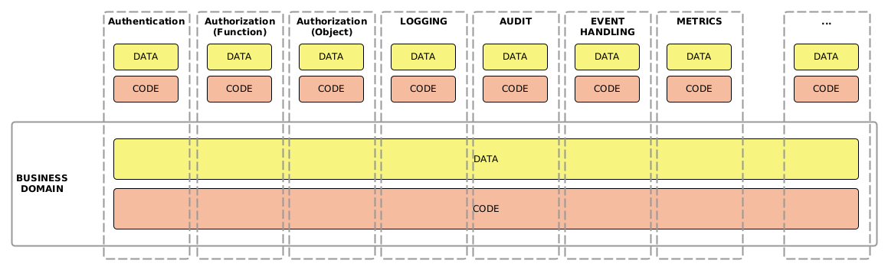

# auditking
Small yet powerful audit trail recording library based on Java and MongoDB

## Introduction

### Business logic code + business data are the core concern

The main concern of the software developers is usually building the business logic that governs the business data. And additionally (and optionally) the interface(s) to interact with that business logic.



### Aspects are of supportive role to business logic/data
  
  Examples:
  - Authentication (who is the user)
  - Authorization (what the user can access/do)
    - function based
    - object instance based
  - Event logging (what happens in the business logic)
  - Error handling (how we want to report the errors)
  - Audit trail recording (how we want to record who changed the data)
  - Other examples:
    - Validation
    - Caching
    - Transactions
    - Internationalization
    - Retry logic
    - Metrics collection
    - Performance monitoring
    - Data limiting and throttling
    - Retry mechanism
    - Data transformation

### Aspects are separate concerns

  Aspects have not only supportive role to the core business logic but also should be considered as dealing with entirely different concerns on their own, separate from the business logic, not affecting it in considerable way. They are orthogonal to the business logic.

### Audit trail recording is an aspect

The functionality of recording the audit information is NOT a core business logic, but rather is a supportive functionality.
This realization should guide the design of the application and proper separation of concerns should be followed which means that the audit trail recording code should be clearly separated, reusable, as well the data should be kept in clear separation from the business data even if it touches certain aspects of that data.

### Reasons why the aspect data and code should be kept outside the business logic
  - Its behavior and data structures may **change independently**
  - We want to keep our business logic and data clean just **clearly separated from other concerns**.
  - **Better code reuse** (no need to reimplement the functionality in business logic code)
  - **Better performance** as part of the processing can be delegated asynchronically to specialized aspect services and not affect business logic performance. 

## Primary purpose of audit trail recording

  - Recording changes in the important data objects
  - When they happened
  - Nature of the operation
  - Who did the changes
  - What was changed specifically

## Features of Auditing Framework

If the auditing functional domain is carefully separated from the business logic there are various profound (and beneficial) consequences:

- **Asynchronous processing**

  When the data needs to be saved into the audit database, we want it to me as performant as possible. Therefore any function like this should be in principle asynchronic (either sending the data to the queue for further processing or spawning new detached thread). This feature should make the code very performant and have minor effect of on the overall business logic performance.

- **No changes to the business data structures**

  When the information collected for the audit trail purposes is kept out from the business data - the data structures can be considerably de-cluttered, holding only the relevant information.

- **No additional code** needed to be added to the business logic.
- **Very simple data extraction** from the DB for reporting purposes.
- Storing whole history of object changes
- No need to modify the core business data structures
- The audit database can be separate from the business data
- The retention can be added and managed separately from the business data retention.

## Design

We can identify following concerns:
- Interfacing with business code (Auditor)
- Performing the recording task (Recorder - abstracted, as there can be various strategies of recording an auditing entry)
- Storing the auditing entry (Storage - abstracted)
- Performing the object difference analysis (DifferenceAnalyzer).

## Sample Java code

### Recording the change:
In order to record the change of the object there are following things needed:
 - old object
 - new (modified object)
 - user information

```Java
import org.springframework.beans.factory.annotation.Autowired;
import org.springframework.stereotype.Service;

@Service
public class MyService{
  @Autowired
  Auditor auditor;

  public updateBusinessObject(BusinessObject obj){
    auditor.setObjectForUpdate(obj);
    
    // Do changes to the `obj`
    obj.name = "Business Object";

    auditor.recordObjectChange(obj, userInfo);

    repository.save(obj);
  }   
}
```
   
All of these operations should be made prior saving updated object in the database using the repository. 

In the example above we have the explicit calls to the `Auditor` class instance. This can be perhaps improved by using the annotations, so this way we can simply declare what object is a subject of our auditing aspect and de-clutter our business logic.

Consider following hypothetical rendering:

```Java
import org.springframework.stereotype.Service;

@Service
public class MyService{
  @Audited(subjects={"obj"})  
  public updateBusinessObject(BusinessObject obj){
    // Do changes to the `obj`
    obj.name = "Business Object";
    repository.save(obj);
  }   
}
```

Now we can see that our business logic is clearly visible and neatly separated from the auditing envelope

The `@Audited` annotation takes an optional parameter which is the list of function parameters that should be subject of audit trail (as there can be more than one). 
If there is just one parameter to the method the `subjects` parameter can be omitted.

### Getting report on the object changes

```Java
// by object id
auditor.reportChanges(systemId, objectClass, objectId);

// by object class
auditor.reportChanges(systemId, objectClass);
```
In the result the above method should return all of the changes that were done on an object of given class and with given ID.

To report all changes made by specific user:
```Java
auditor.reportChanges(systemId, userId);
```

## Decision Matrix

So now we can compare this concept of auditing with other techniques that are in commonly in use.

* **Technique I** - Adding timestamp to tables (**Timestamp**)

    One if the common techniques is to add the timestamp and the ID of the updater to each record of the object in the table.

* **Technique II** - Timestamp and a record copy (**Multiple Records**)

    The other method is to create new record in the table upon the change of any o the values. This way we can have the whole history of changes.

| Criterion                           | AuditKing                                                                       | Timestamp                                                                    | Multiple Records                                                                                                       |
|-------------------------------------|---------------------------------------------------------------------------------|------------------------------------------------------------------------------|------------------------------------------------------------------------------------------------------------------------|
| **Separation of Audit/BL code**     | **YES**                                                                         | NO - audit information is still in the business DB                           | NO - audit data mixed with business data, specialized code needs to be written to handle this for each table/object    |
| **Separation of Audit/BL data**     | **YES**                                                                         | NO                                                                           | NO                                                                                                                     |
| **Impact on writing business code** | **ZERO**                                                                        | SOME - some code needs to be called to write this information to each record | HARD - more complex code needs to be written to write updates as well to retrieve the data.                            |
| **Audit data retrieval**            | **EASY** - one query                                                            | HARDER - query/object                                                        | HARD - query/object                                                                                                    |
| **Impact on performance**           | **SMALL** - if async method is used                                             | **TINY** - as the change is attached to the record which is written already. | LARGE - each query needs to use more resources to sieve through many values, additional indices needed for each table. |
| **Human error factor**              | **TINY** - just add an annotation for the code to work.                         | SMALL - more coding is needed                                                | LARG**FULL**E - complex coding is required                                                                             |
| **Size of code**                    | **TINY**                                                                        | SOME                                                                         | LOTS                                                                                                                   |
| **Maintenance effort**              | **SMALL** - BL and Auditing code can change separately unaffected by each other | LOTS - code is coupled                                                       | LOTS - code is coupled                                                                                                 |
| **History or changes**              | **FULL**                                                                        | LAST CHANGE ONLY                                                             | **FULL**                                                                                                               |
| **Information on what changed**     | **FULL**                                                                        | NOTHING                                                                      | **FULL**                                                                                                               |
| **Need for testing**                | **ZERO**                                                                        | SOME                                                                         | LARGE                                                                                                                  |
| **Sharing audit DB**                | **YES**                                                                         | NO                                                                           | NO                                                                                                                     |


